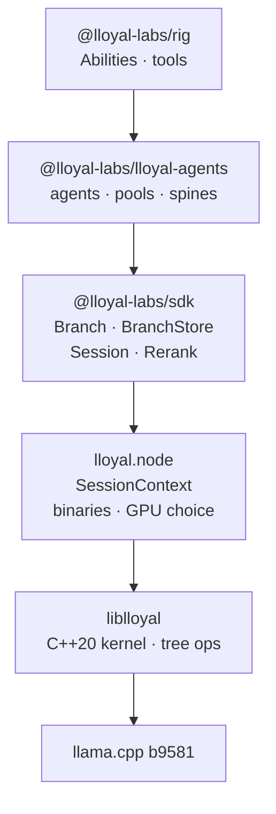

# lloyal.node

[](https://github.com/lloyal-ai/lloyal.node/actions/workflows/tests.yml)
[](https://github.com/lloyal-ai/lloyal.node/actions/workflows/gpu-test.yml)
[](https://www.npmjs.com/package/@lloyal-labs/lloyal.node)
[](LICENSE)
[](https://github.com/ggml-org/llama.cpp/releases/tag/b9581)

**Vertical Inference on Node — the kernel prebuilt for 13 targets, GPU chosen at run time**

[liblloyal](https://github.com/lloyal-ai/liblloyal) is the C++20 kernel: Git-like tree ops over live inference state. This package is how you run it. One `npm install` gets a binary compiled for your platform, a `SessionContext` bound to it, and the rest of the HDK re-exported — so `import { Branch, useAgent } from "@lloyal-labs/lloyal.node"` works without a second package.

Nothing compiles on install. The variant that matches your hardware is chosen when the process starts, so the same artifact ships to a CPU laptop and a CUDA box.

## Install

```bash
npm install @lloyal-labs/lloyal.node
```

| Platform | Arch  | Acceleration        |
| -------- | ----- | ------------------- |
| macOS    | arm64 | Metal               |
| macOS    | x64   | CPU                 |
| Linux    | x64   | CPU / CUDA / Vulkan |
| Linux    | arm64 | CPU / CUDA / Vulkan |
| Windows  | x64   | CPU / CUDA / Vulkan |
| Windows  | arm64 | CPU / Vulkan        |

## Which binary loads

Resolution is ordered and mostly invisible — but when the wrong binary loads, this is the order that decided it.

| # | Source | If it fails |
| --- | --- | --- |
| 1 | `LLOYAL_LOCAL=1` → `build/Release` | **throws** — never falls back to a published binary |
| 2 | `LLOYAL_BACKEND_DIR` → that pack | throws; asserts the devices you asked for |
| 3 | a cached backend pack | throws if present-but-invalid — **no** fallthrough to npm |
| 4 | requested variant — `loadBinary()` argument or `LLOYAL_GPU` | warns and continues, unless `LLOYAL_NO_FALLBACK=1` |
| 5 | local `build/Release` | continues — fresher than an installed package during development |
| 6 | default CPU package for the platform | throws, naming everything it tried |


## Quick start

```javascript
import { createContext } from "@lloyal-labs/lloyal.node";
import { Branch, BranchStore } from "@lloyal-labs/sdk";

const ctx = await createContext({ modelPath: "./model.gguf", nSeqMax: 4 });
const store = new BranchStore(ctx);

const root = Branch.create(ctx, 0, { temperature: 0.8 });
await root.prefill(await ctx.tokenize("Explain quantum entanglement"));

// Fork three ways; every live branch advances in one GPU call per step
const branches = await Promise.all([root.fork(), root.fork(), root.fork()]);
for (;;) {
  const live = branches.filter((b) => !b.disposed);
  if (!live.length) break;

  const produced = live.map((b) => ({ b, ...b.produceSync() }));
  for (const p of produced.filter((p) => p.isStop)) await p.b.prune();

  const items = produced
    .filter((p) => !p.isStop)
    .map((p) => { p.b.accept(p.token); return [p.b, p.token]; });
  if (items.length) await store.commit(items);   // N branches, 1 llama_decode()
}
```

`produceSync()` samples without awaiting so the whole cohort can be collected and committed together — that batching is the point. `await branch.produce()` is the single-branch form.

For one branch, `Branch` is an async iterable:

```javascript
for await (const { token, text } of branch) process.stdout.write(text);
```

See [`@lloyal-labs/sdk`](https://github.com/lloyal-ai/hdk/tree/main/packages/sdk) for the Branch API, continuous tree batching, KV tenancy and topology.

## Who owns what



Everything above `lloyal.node` is backend-agnostic; everything below is native. That seam is why [nitro-llama](https://github.com/lloyal-ai/nitro-llama) can serve React Native from the same kernel.

**Native-only, not in the SDK:**

- `createContext(options)` — load a GGUF, get a `SessionContext`. `mmprojPath` loads a multimodal projector beside it.
- `_storePrefillMultimodal(...)` — image + text into a branch's KV, plus `supportsVision()` / `supportsAudio()`
- `loadBinary(variant?)` — pick the variant explicitly
- The prebuilt binaries themselves

**Re-exported, so one install is enough:** `Branch`, `BranchStore`, `Session`, `Rerank`, `formatChat`, `parseChatOutput`, `jsonSchemaToGrammar`, per-token metrics — and from the agents package `useAgent`, `agentPool`, `useAgentPool`, `withSpine`, `diverge`, `reduce`, `createToolkit`, plus the Ability protocol surfaces (`AbilityRegistryCtx`, `AbilityConfigStoreCtx`, `AbilityManifest`) that pair with rig's `defineAbility` / `createAbilityRegistry`.

## The native surface

`createContext` returns a `SessionContext` — llama.cpp as this package exposes it. The SDK's `Branch`/`BranchStore` wrap these; you can use them directly.

```javascript
const ctx = await createContext({ modelPath: "./model.gguf", nSeqMax: 4 });

// Chat templates — model-agnostic formatting and tool calling.
// NOTE: messages go in as a JSON STRING, not an object.
const { prompt, grammar, format } = await ctx.formatChat(
  JSON.stringify([{ role: "user", content: "hello" }]),
  { addGenerationPrompt: true,
    tools: [{ type: "function", function: { name: "search", parameters: schema } }] },
);
const { content, toolCalls } = await ctx.parseChatOutput(output, format);

// Branch primitives — what Branch wraps
const handle = ctx._branchCreate(0, samplerParams);
await ctx._branchPrefill(handle, tokens);
const token = ctx._branchSample(handle);
ctx._branchAccept(handle, token);
const logits = ctx._branchGetLogits(handle);      // Float32Array(vocabSize)
const child = ctx._branchFork(handle);

// Store primitives — what BranchStore wraps
await ctx._storeCommit([handle1, handle2], [tok1, tok2]);   // N branches, 1 GPU call
await ctx._storePrefill([handle], [tokens]);
await ctx._storeRetainOnly(winner);

// KV, embeddings, grammar
await ctx.kvSeqCopy(0, 1);
const embeddings = await ctx.encode("query text");
const grammar = await ctx.jsonSchemaToGrammar(schema);
```

## Multimodal

An image is decoded, projected into the model's native input embeddings, and admitted through `llama_batch.embd` beside the token stream. After that it is ordinary KV: fork the branch and every child attends the image with no re-encode.

```javascript
const ctx = await createContext({
  modelPath: "./Qwen3.5-4B-Q4_K_M.gguf",
  mmprojPath: "./mmproj-F16.gguf",
  nSeqMax: 8,
});
ctx.supportsVision();   // true

// One <__media__> marker per image, as a media_marker content part
const { prompt } = await ctx.formatChat(JSON.stringify([
  { role: "user", content: [
    { type: "text", text: "What is in this image?" },
    { type: "media_marker", text: "<__media__>" },
  ]},
]));

const handle = ctx._branchCreate(0, { temperature: 0 });
const bytes = fs.readFileSync("./photo.jpg");   // jpg/png/bmp/gif
const [{ tokensDecoded, positionAdvance }] =
  await ctx._storePrefillMultimodal([handle], [[]], [prompt], [[bytes]]);
```

`positionAdvance < tokensDecoded` under M-RoPE — an image costs more KV cells than it advances position, and the kernel tracks the gap so pressure accounting stays exact. Several markers with several images in one prefill also works; video frames with timestamps are exactly that.

> **Types.** `createContext` is typed as `ContextOptions` from `@lloyal-labs/sdk`, so `mmprojPath` / `imageMinTokens` / `imageMaxTokens` and the `supportsVision()` / `_storePrefillMultimodal()` members only typecheck once an SDK carrying multimodal `ContextOptions` is installed. The runtime accepts them regardless.

A configured `mmprojPath` that fails to load throws at `createContext` — never a silent fall back to text-only. Audio is rejected explicitly.

## GPU variant selection

```javascript
import { loadBinary, createContext } from "@lloyal-labs/lloyal.node";

// Automatic — Metal on macOS arm64, CPU elsewhere
const ctx = await createContext({ modelPath: "./model.gguf" });

// Explicit: loadBinary takes the variant directly
const binding = loadBinary("cuda");           // "default" | "cuda" | "vulkan"
const ctx2 = await binding.createContext({ modelPath: "./model.gguf" });
// Falls back to CPU with a warning unless LLOYAL_NO_FALLBACK=1
```

## Examples

| Example                           | Pattern                                           |
| --------------------------------- | ------------------------------------------------- |
| [`chat/`](./examples/chat/)       | Interactive streaming chat                        |
| [`embed/`](./examples/embed/)     | Text embedding extraction                         |
| [`entropy/`](./examples/entropy/) | `modelEntropy()` mid-generation as a control signal |

```bash
npx tsx examples/chat/chat.ts ./model.gguf
```

## CI

Integration tests run real inference across architectures, so a template regression surfaces as a wrong answer rather than a clean pass:

| Model        | Template   |
| ------------ | ---------- |
| SmolLM2 1.7B | chatml *(default)* |
| Llama 3.2    | llama3     |
| Phi 3.5      | phi3       |
| Qwen3        | chatml     |
| Gemma 3      | gemma      |
| GLM-Edge     | glm-edge   |

Multimodal runs two tiers: SmolVLM-256M for plain positions in CI, Qwen3.5-4B + mmproj for M-RoPE locally and on the GPU rig. See [distribution.md](docs/distribution.md).

## Ecosystem

| Package | Description |
| --- | --- |
| [`@lloyal-labs/sdk`](https://github.com/lloyal-ai/hdk/tree/main/packages/sdk) | Backend-agnostic inference primitives |
| [`@lloyal-labs/lloyal-agents`](https://github.com/lloyal-ai/hdk/tree/main/packages/agents) | Multi-agent runtime + Ability protocol primitives |
| [`@lloyal-labs/rig`](https://github.com/lloyal-ai/hdk/tree/main/packages/rig) | Abilities — `defineAbility`, the registry, and the retrieval and framework tools they are built from |
| [`harness.dev`](https://www.npmjs.com/package/harness.dev) | CLI — scaffold harnesses and Abilities, publish/install signed Abilities |
| [liblloyal](https://github.com/lloyal-ai/liblloyal) | The C++20 kernel |
| **lloyal.node** | This package — native backend + prebuilt binaries |
| [nitro-llama](https://github.com/lloyal-ai/nitro-llama) | React Native backend via Nitro Modules |
| [tsampler](https://github.com/lloyal-ai/tsampler) | Reference sampler implementation |

## Contributing

See [CONTRIBUTING.md](./CONTRIBUTING.md) for development setup and the release process.

## License

You can build and sell commercial products using lloyal.node.

lloyal.node 3.0 is source-available under FSL-1.1-Apache-2.0 and converts
to Apache 2.0 two years after each release. The restriction is narrow: you
cannot offer a competing HDK runtime, managed HDK service, or alternative
HDK App distribution channel.

See [`LICENSE-FAQ.md`](./LICENSE-FAQ.md) for concrete examples of what's
permitted and what's restricted. See [`LICENSE`](./LICENSE) for the legal
text and [`NOTICE`](./NOTICE) for attribution including the bundled
llama.cpp MIT dependency.
